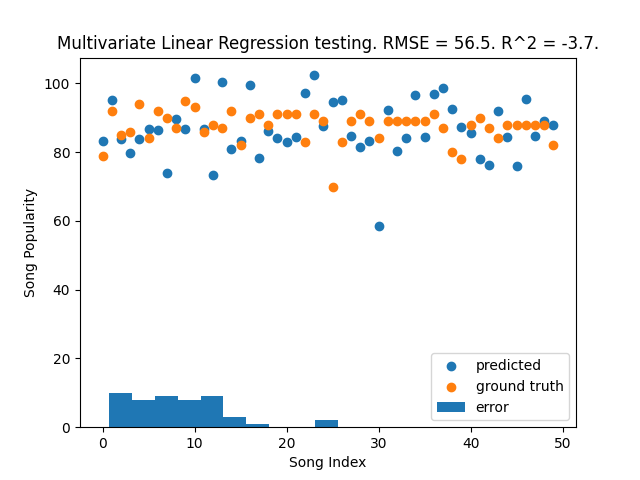
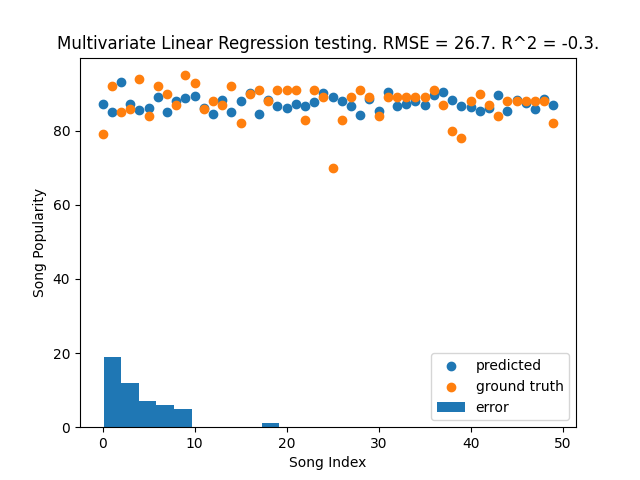

# Assignment 1
## FYS-2021 Machine Learning H22
### Victor Zimmer, victor.zimmer@uit.no, vzi002

 

## Problem 1

### Task 1

With the standard model $r = f(x) + \epsilon,$

Multivariate linear regression starts from a very simple basis with the equation for any given line $y = mx + n$ where $y$ is a dependent variable of the independent variable $x$ and $mx + n$ defines a line in 2D space. For this line $n$ is the intersect with the y-axis, that is the value of $y$ at $x=0$, and $mx$ represents the rate $m$ in relation to the change in $x$.

From this simple basis univariate linear regression is easily derived to find a line that best fits the trend in a given dataset. Often its represented as $\hat{y} = \theta_0 + \theta_1 x$ where $\hat{y}$ is the response or estimate, based on variables in the dataset. $\theta$ is used for the tunable values of the equation with $\theta_0$ being the equivalent of $n$ in our previous line equation and $\theta_1$ corresponding to $m$.

Univariate linear regression can relative easily be tuned to fit the trend of a given dataset, for example using the least squares method.

In the model $r = f(x) + \epsilon,$ this is extended to multivariate linear regression. Our estimate function $g(x|\theta)$ gives us $g(x) = \theta_0 + \theta_1 x_1 + \theta_2 x_2 + ... + \theta_K x_K$ where $K$ is the length of our variable set. \theta_0 gets a special name with it being our *bias*. \epsilon represents external variables that are not caught by our model.

We begin by initializing \theta with random values, which gives a poor regression, and then tuning that such that the regression improves. With enough steps this should give a better, and maybe even satisfactory, regression. 

To be able to tune \theta we need a measure of the error from the desired output, for the given dataset, this is done with a *cost function*. This looks a lot like a multivariate extension of the least squares method, with the cost function defined as $C(\theta) = \frac{1}{2K}\sum{(\hat{y}_k - y_k)^2}$. 

The cost function simply subtracts the true output from the estimated output and squares it removing negativity, this is averaged for the dataset to give a measure of the error for a given input and output.

This can be used to update our theta values to improve our regression for a given input and output. Pairing this with a scaled learning rate we can train the regression on a dataset by iteratively running steps of tuning for all variables in our training data set. This learning can be done by slightly adjusting our values for $\theta$ in the direction that reduces the difference between our estimation and our expected output, which is equivalent to adjusting the values of $\theta$ slightly based on the derivative of the cost function, in the direction that reduces our cost. For any value of $\theta$ this looks like $\theta_0 = \theta_0 - \alpha \frac{d}{d \theta_0}C(\theta_0)$, where $\alpha$ is a constant learning step size to scale our change per step.

This requires a differentiation of our cost function with respect to a \theta_k $C(\theta) = \frac{1}{2K}\sum{(\hat{y}_k - y_k)^2}$ which gives us $\frac{d}{d \theta_k}C(\theta) = \frac{1}{K}\sum{(\hat{y}_k - y_k)x_k}$. We are not asked to prove this partial differentiation, but if we wanted to we could do so simply by using the chain rule and treating $(\hat{y}_k - y_k)$ as an inner function.

#### Implementation

I implemented this in three phases. 

**First phase** was the implementation of the above math as code in the functions `rs, cost, tuneTheta, predictDataset, learnDataset`

`rs(theta, x)` simply uses the given theta values and x values to make predictions for a y-value, this is done by multiplying together the theta and x-values and summing them. It is this function $g(x|\theta)$ gives us $g(x) = \theta_0 + \theta_1 x_1 + \theta_2 x_2 + ... + \theta_K x_K$ with an $x_0$ implemented as $x_0 = 1$ for convinience.  

`cost(theta, x, y)` calculates the cost of a given set of theta values. It is this function $C(\theta) = \frac{1}{2K}\sum{(\hat{y}_k - y_k)^2}$.

`tuneTheta(theta, x, y, learningRate, iterations)` runs a given amount of iterations attempting to nudge the values for theta according to $\theta_k = \theta_k - \alpha \frac{d}{d \theta_k}C(\theta_k) = \frac{1}{K}\sum{(\hat{y}_k - y_k)x_k}$. The value for $\alpha$ is given by the learning rate.

`predictDataset(dataset, theta)` is implemented as a utility for further code, but it returns a prediction for a y, using `rs()`, given theta values and a dataset. The goal is for it to accept a dataset similar to `learnDataset`.

`learnDataset(dataset, learningRate, iterations)` takes in an entire dataset and uses the provided learning rate and iteration count to run the functions above to optimize theta values. It initializes theta as random numbers between zero and one, any number could be used, but using random numbers allow for rerunning the algorithm to potentially result in a better (or worse) model. It then returns the optimized theta values.

**Second phase** was the implementation of the leave-one-out cross-validation which is implemented in the `loocv(learningRate, iterations)` function. It allows for setting the number of iterations and learning rate, and then it uses the read dataset. It iteratively splits the dataset into a validation set containing one row from the original dataset and a training set containing the rest, then it train a model using the training set before using this model to predict the value in the validation set (the one left out). It returns a dictionary containing the data from its run.

**Third phase** was the implementation of plotting and statistical numbers for the model. The plotting is done in `plotData()` which uses `loocv()` to run the model(s), and then uses *matplotlib* to plot the data with a scatter plot for both the predicted and true data, a histogram for the errors, and a title with the RMSE and R^2

*Figure 1*

After implementing the third phase I decided to normalize the x-values in the dataset as the predictions was quite bad. Normalization helped, probably because it equalizes the effect of all $x_i$, but still the model(s) are far from perfect. In figure 1 we can see the result of a run before normalization, with $R^2 << 0$ telling us that its far worse than a simply the mean of the data. In figure 2, which is with normalization, this has improved considerably, however we still have $R^2 < 0$ telling us the model is slightly worse than the mean.

*Figure 2*

<!-- # Other stuff

$\hat{y} = \beta_0 + \beta_1x_1 + \epsilon$

Assumptions:
x independent, y dependent on x (fit for regression analysis)
linear correlation
continoous

r = response

f(x) = true function

$g(x|\theta)$ = estimate function

x is a variable in a univariate model and a vector in a multivariate model

$\theta$ variables for function $r(x) = \theta_0 + \theta_1 x$

$\epsilon$ error

Least squares method
Regression line

### Task 1b

The learnable parameters are $\theta$, they define the slope and intersect of the regression line. -->